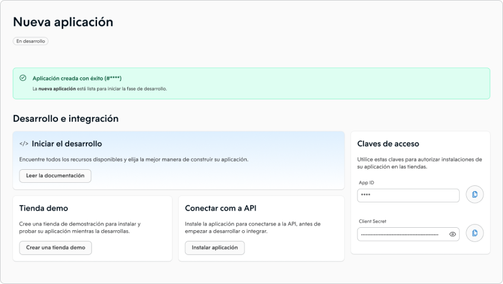

# Nuvemshop react api template for Integrated Apps

## Introduction

This API serves as an example and provides a solution for application authentication and efficient product management within a Nuvemshop/Tiendanube store.

With this API, developers can authenticate their applications and store credentials securely in the `db.json` file. It allows various operations such as randomly inserting new products, deleting existing products, and retrieving the total product count. This API exemplifies seamless integration and robust product management capabilities.

By using this product management API, developers gain insights into Nuvemshop/Tiendanube ecommerce solutions, empowering them to build scalable custom applications for the platform.

Explore the features, endpoints, and usage examples provided in this README to unlock the full potential of the Product Management API for effective product management in Nuvemshop/Tiendanube stores.
This API serves as an example and provides a solution for application authentication and efficient product management within a Nuvemshop/Tiendanube store.

With this API, developers can authenticate their applications and store credentials securely in the `db.json` file. It allows various operations such as randomly inserting new products, deleting existing products, and retrieving the total product count. This API exemplifies seamless integration and robust product management capabilities.

By using this product management API, developers gain insights into Nuvemshop/Tiendanube ecommerce solutions, empowering them to build scalable custom applications for the platform.

Explore the features, endpoints, and usage examples provided in this [link](https://dev.nuvemshop.com.br/en/docs/getting-started#nuvemshop-api) to unlock the full potential of the Product Management API for effective product management in Nuvemshop/Tiendanube stores.

## Configuring environment variables

To successfully integrate with our apis, it is necessary to make some settings in the `.env` environment variables file, for this it is necessary to rename the `.env.example` file to `.env` in the root of the `api` folder.

It is also necessary to prepare our local database for this and rename the `db.example.json` file to `db.json` in the root of the `api` folder.

```bash
# Port where the backend will run
PORT=8000

# for latam https://www.tiendanube.com/apps/authorize/token
# for BR https://www.nuvemshop.com.br/apps/authorize/token
TIENDANUBE_AUTENTICATION_URL=https://www.tiendanube.com/apps/authorize/token

# for latam https://api.tiendanube.com/v1
# for br https://api.nuvemshop.com.br/v1
TIENDANUBE_API_URL=https://api.nuvemshop.com.br/v1

# App settings
# You client secret for app
CLIENT_SECRET=

# You app id
CLIENT_ID=

# Your Partners Portal account email
CLIENT_EMAIL=

# Your secret
SECRET_KEY=THE_SECRET
```

## Authentication

To authenticate your app exclusively through the API Template, regardless of the Frontend Template, you need to make a modification to your app's redirect URL in the Partner Portal to the API URL and then install it from a store .

1. Access the application details page in the Partner Portal.
   

2. Navigate to the basic data edit card.
   

3. You will find the card dedicated to your app URLs.
4. Change the "Redirect URL after installation" field to the address where your API is running, along with the path `/auth/install`, for example: http://localhost:8000/auth/install.

This will ensure that when the authentication process is triggered, the app will be redirected to the designated URL, including the necessary `code` query string. The `code` parameter is essential for constructing the body of the POST request to the `https://www.tiendanube.com/apps/authorize/token` authentication API. Upon successful authentication, the API will respond with an object that should be securely stored within the `credentials` property of the db.json file.

## Using the API with an Existing Access Token

If you already have a valid access token for our APIs, the previous steps do not need to be performed. Simply replace the data in the "credentials" field of the `db.json` file, following the model below.

```ts
{
  "credentials": [
    {
      "access_token": "af56c0d9f79f37636927e9f6ec32a31ba135a34e",
      "token_type": "bearer",
      "scope": "write_products",
      "user_id": 2099076
    }
  ]
}
```

## Limitations and Considerations

- The `db.json` file simply stores the credentials of a store, and when the installation process is repeated, the old object is replaced by the new one.
- It is necessary to rename the `.env-example` file to `.env` and configure the environment variables with the requested values; otherwise, it will not work.
- If you don't change the redirect URL in the Partners Portal to the port where the project is running, it won't be possible to authenticate the app or access the Product API.
- For the Product API to work, the app must have `Write products` permission. [Learn more about permissions](https://dev.nuvemshop.com.br/en/docs/developer-tools/nuvemshop-api#accessing-the-product-api)

## References and Additional Resources

- [Authentication](https://dev.nuvemshop.com.br/en/docs/applications/authentication)
- [Nuvemshop/Tiendanube API - Product](https://dev.nuvemshop.com.br/en/docs/developer-tools/nuvemshop-api#accessing-the-product-api)
- If you have any questions or need further assistance, please don't hesitate to reach out to us through the Help section of the Partners Portal.
